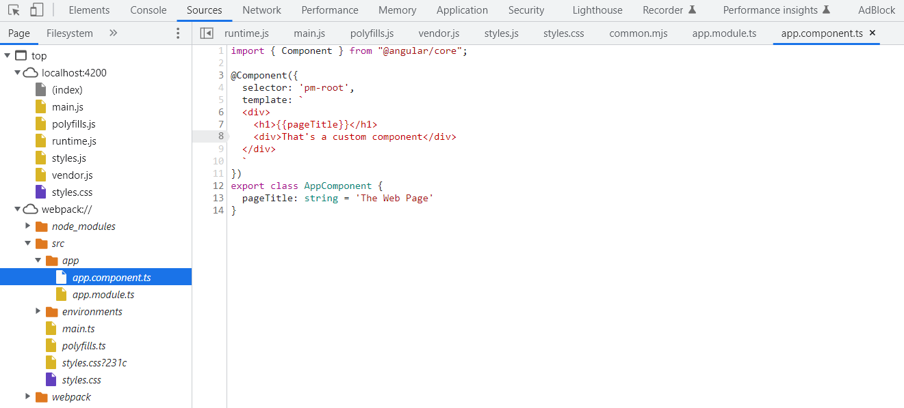

# Angular Sandbox

Step by step guide on [Angular](https://angular.io/) framework with code examples.

> Please take into account that some examples imported to this guide may be provided under different licensing terms than this guide.

## What is Angular

**Angular** is a **JavaScript** framework, that uses **HTML**, **CSS** and **TypeScript** to build client-side applications.

## Angular's benefits

* Allows to embed features (E.g. loops, local variables, if stetements) into **HTML**, which makes it more expressive.

* Provides data binding functionalities that allow to bind data to the **UI**

* Enforces modular design
* Provides built in functionalities that ease up Back-End integration

## Development tools

* **Code Editor** - Suggested: [VS Code](https://code.visualstudio.com/)
* **npm** - It comes bundled with [Node.js](https://nodejs.org/en/), therefore **Node** installation is necessary to get **npm**.

* **(globally) installed Angular CLI (ng)** - installation is performed via **npm**

  ```powershell
  npm install -g @angular/cli
  ```

## Angular application architecture

Angular applications consist of multiple **components** and **services** (E.g. service for accessing data from Back-End app), that can be shared between these.

### Components

An **Angular component** consists of:

* **Template** - **HTML** that defines the view
* **Class** associated with the view, which consists of:  
  * **Properties** - Data elements available for binding to the view
  * **Methods** - Actions for the view that perform actions like response for uses input

   It can be also called **Code Behind**
* **Metadata** that provides additional information about the component to **Angular**

## TypeScript

Open-Source programming language developed by **Microsoft**. It is a superset of JavaScript and it's used for building **Angular** applications.

### Transpilation

Before being interpreted by a web browser, **TypeScript** must be compiled to plain **JavaScript**.  

### Strong typing

It's the main feature of **TypeScript**. That means that every object in the code has to be a well known type. But if the default value is assigned to the variable at the declaration type, there is no need to specify the type, since **TypeScript** will automatically determine it.

### Class-based object-orientation

**Type Scripts** implements such **OOP** concepts as:

* Classes
* Interfaces
* Inheritance

## Required dependencies

In order to develop **Angular** application, thing such as:

* **Angular** framework and libraries
* **Angular  CLI**
* **TypeScript** programming language
* Testing tools
* Other dependencies

are needed.

### package.json

Luckily there is no need to download all of that manually. `package.json` file, that specifies **npm**  project package requirements can be created. **npm** installs all the specified dependencies and distinguishes between:

* development only dependencies
* release dependencies

It contains also metadata about the build like **version** or **project name**, and **scripts** which are executed when a certain **npm** command is being run. This mapping allows to use the same **npm** commands for **build**, **run**, **tests** and so on, in different projects based on different technologies.

## Running Angular application

Typically **Angular** utility **scripts** look something like this:  

```json
 "scripts": {
    "ng": "ng",
    "start": "ng serve -o",
    "build": "ng build",
    "watch": "ng build --watch --configuration development",
    "test": "ng test"
  }
```

* **ng** runs **Angular CLI**
* **serve** command for, tells **ng** to build the project and run local development web server
* **-o** flag is used to open the development web server's exposed **URL** in hosts default web browser

> To stop the running development server terminate the server console session the way You like E.g. by using **^C**

## Single Page Application

**Angular** based applications are the **Single Page Applications**, which means, that in reality only the `index.html` is the real web-page sent to the client. The rest is the **JavaScript** (as an output from the **TypeScript** compilation).

So the whole application is sent to the **client's web browser** and all the interactions happen in **client's browser** even when user is accessing different **URL** since **Angular routing** functionality is providing support for that.  

## Creating new Angular app

```powershell
ng new <app_name> --prefix <prefix>
```

`--prefix` command allows to specify custom prefix. When not specified, the default value  is `app`.

During execution of this command, **Angular CLI** will ask for some choices to be made about the new application.  

---

## Component's architecture

An **Angular** component can look like this:

```js
import { Component } from '@angular/core';

@Component({
  selector: 'pm-root',
  template: `
  <div><h1>{{pageTitle}}<h1>
    <div>My First Component</div>
  </div>
  `
})
export class AppComponent {
  pageTitle: string = 'Acme Product Management';
}
```

* most bottom part starting with `export` keyword is the **class** that provides all the data and methods for the view - it can be thought of as **code behind**
* Section inside the `@Component({...})` element is the **decorator** that contains:
  * metadata
  * template
* `import` section imports outside code.

### Component's Class

As you see in above example **class** name consists of two parts:

* feature name
* `Component` appended to the end of the name

> camell casing is the casing convention for class names

For the root component of an application `app` name is used. Names are later used when referenced in code.

`export` keyword makes the class avaliable to use for other components of the application.

Body of the class consists of:  

* properties
* methods

On the above example only one property of type **string** with default value specified is being present.

### Component's Metadata (provided by decorator)

Classes with corresponding metadata attached create **Angular** components. Metada is being attached as a **decorator**.

**Decorator** is a function that adds metadata to a **class**, its members or its method arguments.

* it's a **TypeScript** feature (however it's a requested feature to implement in next **JavaScript** versions)
* scope of the decorator is limited to the feature it decorates.
* it's prefixed with `@` sign
* Angular provides built-in decorators to provide additional information to Angular
* it's placed exactly above the feature it's decorating. In above example it is placed exactly above the class it decorates
* it's simmilar to **attributes** used in other programming languages, thus there is no semicolon at the end of decorator
* it's a function so at the end it conains opening and closing set of parenthesis: `()` to pass any arguments like an object enclosed in `{}` curly braces

For example `@Component({})` decorator is used to identify a **class** as a **component**.

Object passed to the `@Component({})` decorator can have multiple properties. In above example there are two: `selector` and `template`. Actually a **component** should always have a **template**

**Selector** is a name used to reference the component in **HTML** as a **directive**.

**Directive** is a custom **HTML** tag. Whenever there is a directive placed in **HTML**, corresponding component will be rendered in that place.

```html
<div><h1> {{property_name}} <h1>
```

Double curly braces syntax `{{...}}` is used for **data binding**. As seen in the previous example, the **class** property is being bound to the **template's HTML** using that syntax.

**Template** is an actual **HTML** that the components consists of. It can be:

* specified inline as a single line enclosed in double quotes - using `template:` property
* specified inline as a multi line enclosed in backticks - using `template:` property
* specified in separate file - using `templateURL:` property with path to the file containing the **HTML**

First two approaches does not provide **IDE's** support for syntax highlighting.

### Good component

Should utilize:

* Strong typing
* Interfaces - for custom types
* Encapsulation of it's own specific styles
* Usage of pipes for propper data display
* Nesting of other component if necessary in order to reuse existing code

### Encapsulating styles into component

To ship custom styles with an easy to manage way with the component. There is a dedicated `styles` property (an array) that can be added in the `@Component({})` decorator's object.

```typescript
@Component({
  selector: 'app-userList',
  templateUrl: './user.list.component.html',
  styles: ['thead {color: #427BA8}']
})
```

Outside stylesheets can be also utilized, using `styleUrls`
property to specify the array of stylesheet **URLs**.

## Component's lifecycle

Actual lifecycle of **Angular** component consists of:

* Creation
* Render
* Creation and render of children
* Processing changes (by binding)
* Disposal

### Lifecycle hooks

**Angular** provides a way to perform actions when a certain lifecycle event occurs. This functionality is implemented via **lifecycle hooks** - interfaces that allow to bind a method to lifecycle event. Most popular **lifecycle hooks** are:

* `OnInit` - used to perfrom component initialization and data retrieval
* `OnChange` - used to perform actions after **input properties** change
* `OnDestroy` - used to perform cleanup before destroying a component

To implement a **lifecycle hook**:

* import it's interface from `@angular/core` E.g. `OnInit`
* make your component's class implement that interface
* implement the interface method E.g. `ngOnInit()`

## Component's usage

* **As a directive** - results in rendering of `App` component or nested components

* **As a Routing target** - results in full page style view

## Importing

In order to use an external **class** or **method** in a file, there need to be some reference provided for compiler to instruct him where to look for that **class** or **method**. To do so `import` statement is used. It's a **TypeScript** feature simillar to **import** or **using** statements used in different languages.

The keyword `import` allows to use **exported** members (proceededd with `export` keyword) from:

* other files within the application
* Angular framework
* external **JavaScript** libraries

That's why in the previous example

```js
import { Component } from '@angular/core';
```

statement was being used. `Component()` decorator function was not defined in the file, but exists somewhere. Therefore compiles must be instructed where to find it.

## Modules

* used to group components in logical structures, which increases projects structure clarity.  E.g. all modules regarding fetching the data could be bundled into a module
* provide scope for components
* components are being assigned to, or imported into modules

Out of the box, `AppComponent`, which is the root component, have following structure:

```js
import { NgModule } from '@angular/core';
import { BrowserModule } from '@angular/platform-browser';
import { AppComponent } from './app.component';

@NgModule({
  declarations: [AppComponent], // here components contained by this module
  imports: [BrowserModule], // here all the modules that are ment to be imported into the app: user defined ones, third party ones, Angular ones
  bootstrap: [AppComponent] // startup component of the application - should contain the selector used in the index.html document
})
export class AppModule { }
```

It utilizes the `@NgModule()` decorator. Properties passed to the decorator are arrays.

`BrowserModule` is a necessary module for every browser application.

---

## Debugging the application

**Chrome developer tools** offer a wide range of features. Thingls like **Elements** - displaying **DOM** or **Console** are pretty much self explainatory. But **webpack's** possibility to debug **TypeScript** (thanks to map files) is worth mentioning in context of **Angular**.



---

## Importing Bootstrap and Fontawesome

Both can be installed as packages using **npm**.

```npm
npm install bootstrap font-awesome
```

Packages can be then referenced in global `.css` file.

```css
@import "~bootstrap/dist/css/bootstrap.min.css";
@import "~font-awesome/css/font-awesome.min.css";
```

There is also [Angular dedicatet version](https://github.com/FortAwesome/angular-fontawesome) of **font-awesome**. [Official documentation](https://fontawesome.com/docs/web/use-with/angular) explains how to use it well.

---

## Binding

It's a functionality that coordinates communication betwen the component's class and its template. Class provides data for the template. The template can raise events to trigger speciffic behaviours or pass data back to the class.

### data binding

* **Interpolation** - One way data binding from class to template. It supports simple math and string concatenation. Double curly brackets are used to interpolate a value: ``. Interpolation can be used directly between tags or to assign a value to tag's property. E.g.

  ```HTML
  
  ```

  At the and it always assigns the value as a string. As already said it support string concatenation, so but when the binded value should be a part of some longer string, the solution is to use interpolation instead of **Property Binding** E.g.

  ```HTML
  
  ```

* **Property Binding** - Another one way data binding from class to template. it allows to bind to different types like **boolean** but does not alow the binded value to be a part of a longer string. It is used to bind values to tag attributes.

  ```HTML
  
  ```

* **Two Way Binding** - Requires import of `FormsModule` from `@angular/forms`. It is a part of `FormsModule` since forms most often utilize two way data binding.

  `[(ngModel)]` directive is used to actually perform the binding. There is no need to specify what attribute is bound with the specified property, since the directive automatically binds it with the right attribute.

  ```HTML
  <input type="text" [(ngModel)]='listFilter'/>
  ```

### event binding

Connects an event to the method in the component.

```HTML
<button (click)='toggleImage()'>
```

Here **click** event of **button** is bound to `toggleImage()` method, so clicking the button will invoke this method. All available events could be found online, for example on [Mozilla Developer Network Web Docs article](https://developer.mozilla.org/en-US/docs/Web/Events).

## Pipes

They are very closely related with data binding. Since they are used to transform bound data before display.

Angular provides some built in pipes for very common conversions like: **dates**, **numbers**, **decimals**, **percents**, **currencies** and **JSON**, but custom pipes can be also created as needed.

Using pipe literally involves pipe symbol `|` and name of the pipe. E.g.

```HTML
<h4>
  Filtered by: {{ listFilter | lowercase }}
</h4>
```

```HTML

```

Pipes can be chained.

```HTML
{{ product.price | currency | lowercase }}
```

As well as they can accept parameters

```HTML
{{ product.price | currency:'USD':'symbol':'1.2-2' }}
```

Above example consists of three parameters passed to `currency` pipe. Second one tells the pipe to display the symbol instad of currency abbreviation. The last one means that there must be at least one integer digit before the decimal point, at least two digits after the decimal point and no more than to digits after the decimal point.

### Implementing custom pipe

Depending whether it's a pipe shared by many components or a component specific one, create a dedicated `.ts` file in `shared` or component's directory. Then compose the file:

* import `Pipe` and `PipeTransform` from `@angular/core`
* create exported class following naming convention `<...>Pipe`
* add `@Pipe({})` decorator with `name` property
* make the class implement `PipeTransorm` interface
* implement interface's method: `transform`

### Using custom pipe

In order to use a custom pipe:

* import the pipe's class to the module it will be used in or in `app` module for global usage
* include the imported class in `declarations` **property** array

---

## Built-in Directives

As mentioned earlier custom directives can be used to place components by their selectors. **Angular** also provides some built-in directives:

* **Structural directives** - modify structure/layout of the view, by adding, removing or manipulating elements and their children. For example:
  * **if** statements: `*ngIf: if logic`
  * **for** loops: `*ngFor: For loop`

The asterix at the beginning means that these are **structural directives**. They are provided by the `BrowserModule`.

### `ngIf` directive

Creates or removes content of **DOM** tree based on evaluated expression. Below example displays the table only when it's not empty.

```HTML
<div class='table-responsive'>
  <table class='table' *ngIf='products.lenght'>
    <thead>
      ...
    </thead>
    <tbody>
      ...
    </tbody>
  </table>
</div>
```

### `ngFor` directive

```HTML
<tr *ngFor='let product of products'>
  <td></td>
  <td>{{product.productName}}</td>
  <td>{{product.productCode}}</td>
  <td>{{product.releaseDate}}</td>
  <td>{{product.price}}</td>
  <td>{{product.starRating}}</td>
</tr>
```

## Interfaces

**Angular's** **interfaces** act as specification of a related set of properties and methods. There are two ways to use an **interface**:

* As a type - **interface** identifies properties of a type. Later when definig a variable, interface is used as type. It is a good practise to define interface for any unique data type

  ```typescript
  export interface IProduct {
    productId: number;
    productName: string;
    price: number;
  }
  ```

* As a feature set - **interface** identifies set of properties and methods declarations, that perform certain action. That is simmilar to **OOP's** usage of **interfaces**. To implement an interface into component's class, `implements` keyword is used along with interface name.

## Getters and Setters

In **Angular** concept of **getters** and **setters** is very similar to what is known from popular object oriented programming languages.

**Getters** and **setters** require private backing variable to store the actual value, naming convention for such is: `_<name>`.

```typescript
private _price: number = 0;
get price(): number {
  ...
  return this._price;
}
set price(value: number) {
  this._prcie = value;
}
```

Usage of **getters** and **setters** covers any modifications of value and any actions that should take place during that modifications. E.g. when filter textbox is updated, the list that is about to get filtered should actually get filtered. To use **getter** or setter simply try to read the property  value or asign the property a value.

```typescript
this.price = 100;
```

```typescript
console.log(this.price);
```

Good place to initialize a property with some default value is `ngOnInit()` lifecycle hook method.  

## Arrow functions

A concept similar to anonymous functions with **C# lambda operators**, E.g.

```typescript
(product: IProduct) => product.productName.toLowerCase();
```

---

## References

* [Angular Docs](https://angular.io/docs)

* [TypeScript Website](https://www.typescriptlang.org/)

* [Angular: Getting Started Pluralsight Course](https://app.pluralsight.com/library/courses/angular-2-getting-started-update/table-of-contents)

* [DeborahK's Angular-GettingStarted GitHub Repository](https://github.com/DeborahK/Angular-GettingStarted)

* [Mozilla Developer Network Web Docs article on web events](https://developer.mozilla.org/en-US/docs/Web/Events)
